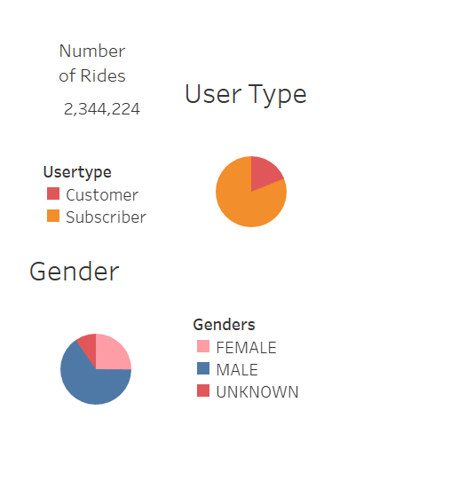
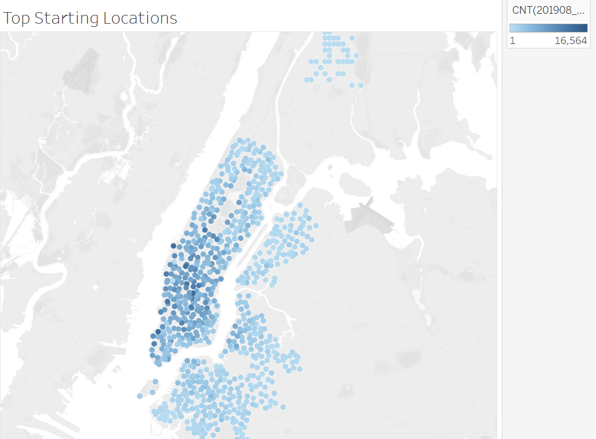
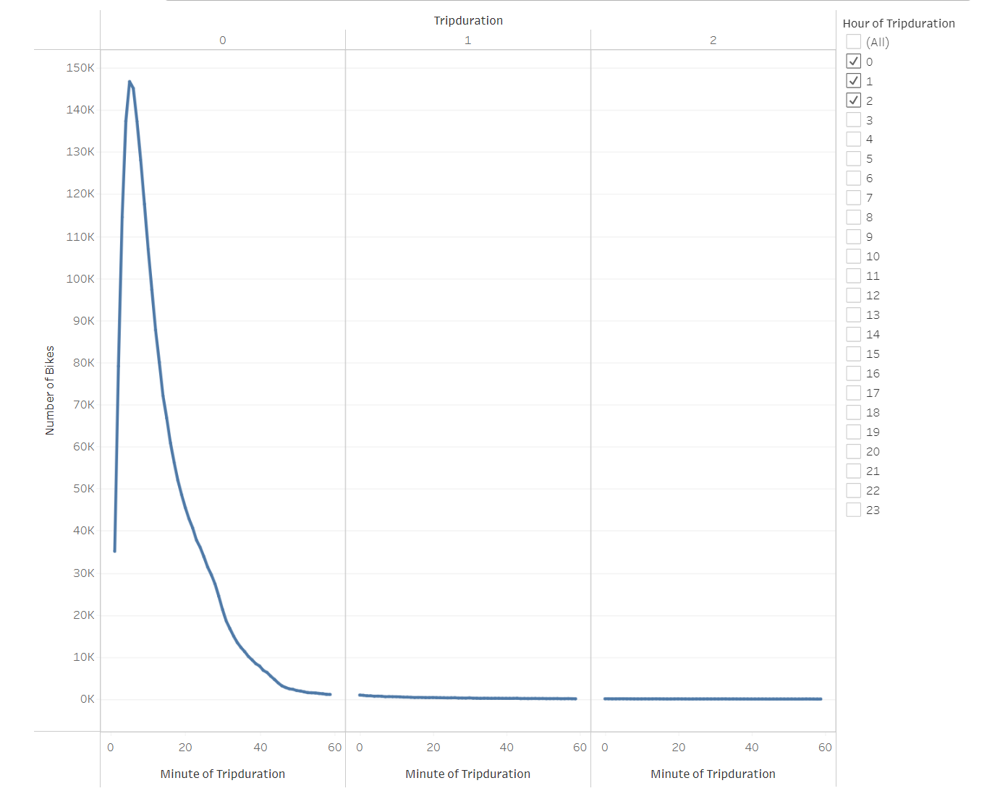
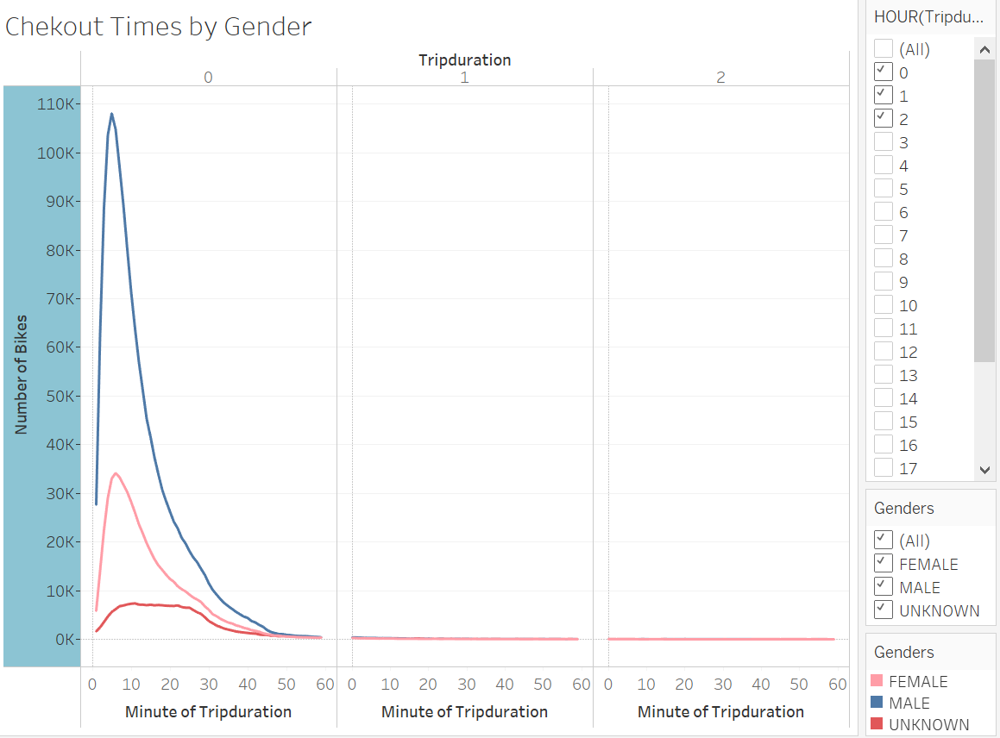
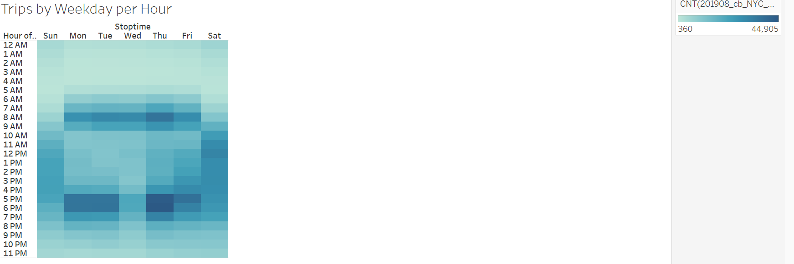
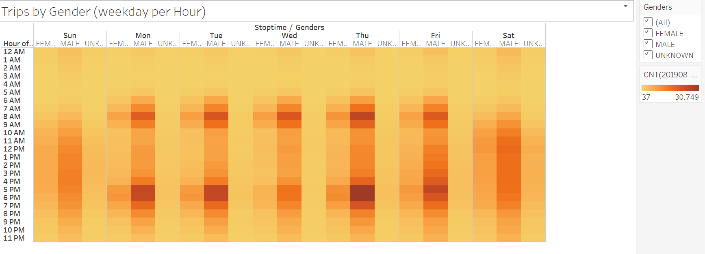
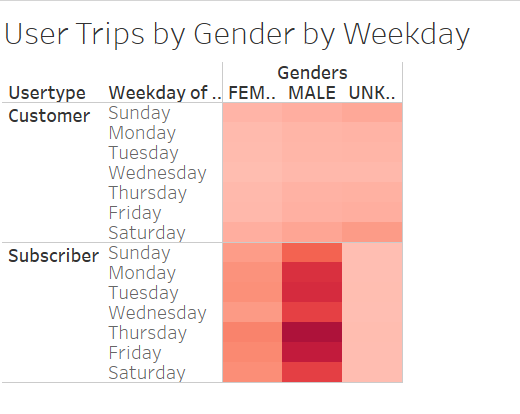

# Bikesharing with NYC CitiBike
Analysis of NYC CitiBike data from August 2019.

## Resources
Tableau, Jupyter Notebook

## Overview
The main object here was to provide visualization of CitiBike data for potential investors.
Some important questions client would like answered before investing in CitiBike sharing in other cities:
* Who uses bikesharing services?
* What area of city are most bikes used?
* When are bikes used most often?
* How long are bikes used for at a time?

The link for this project can found here: [NYC CitiBike Analysis](https://public.tableau.com/app/profile/natalie.cagno/viz/NYCCitiBikeAnalysisStory_16571254660570/NYCCitiBikeAnalysis?publish=yes)

## Results
### Demographics
Taking a look at user demographic data from the 2,344,224 rides in August that majority are Subscribers and about 60% are males

### Top Starting Locations
The bulk of rides start in the heart of NYC where majority of tourists and commuters are located.
The further away datapoints are more than likely local residents.

### Trip Duration by Users
By graphing the number of trips by duration shows that the majority of trips are under an hour in length.
More specifically, most trips are under 20 minutes.

### Trip Duration by Gender
Similar to the above, we can analyze trip duration by gender. From this graph we can visualize the male indentifying customer demographic.

### Trips by Weekday
Based on the heat map of ride totals by hour for each weekday, it is evident that the most popular biking times for Weekdays are around commuting time (6AM-9AM and 5PM-7PM) while on the weekends its seems to be fairly consistend between 11AM-7PM.

### Trips by Weekday by Gender
Similar to the above, by adding in the gender layer we can then see the hourly breakout at more specific level between male, female and unknown/unidentified.

### User Trips by Gender and Weekday
To further investigate the gender breakout by usage and user type, adding in the User Type variable shows daily usage broken out by gender and customer type.
Here we can conclude that the heaviest usage population is from Male subscribers on Thursdays with nearly 260,000 rides.

## Results 
In summary, bikeshare services are extremely popular in densely populated cities and busy metropolitan areas. Those who identify as male make up the majority of customer base , and while they are a reliable customer base a recommendation I would provide would be to make marketing outreach for women specifically.
Main usage seems to be around commuting purposes so I would focus majority of marketing efforts on those with full time in person jobs.
If further investigation is requested, I would first look into trip duration by age and gender to get a better understanding of customer demographic by age more specifcally. Another angle I would consider investigating would be start and end locations for bikes on the weekends to see if an increased bike presence would be required for more heavily foot trafficked tourist locations or nightlife.
